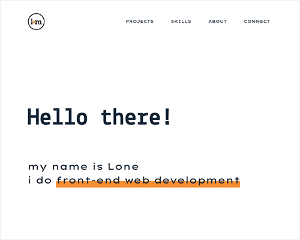

# lonemortensen.com
This is my personal website. A single-page responsive portfolio site. Built with HTML5, CSS3, Flexbox, and JavaScript.

## About
This single-page portfolio website utilizes space-saving components such as modal windows and a tabbed panel. These features encourage users to engage with the site in order to access information about web projects and developer skills — all while keeping things compact.

A responsive website, it seamlessly adapts to different screen sizes and functions across mobile, tablet, and desktop screens. 

The website uses CSS and JavaScript to create animations for behavior and interest.  

## Project Background
My goal for the project portfolio site was to design and develop a website that is:

**Custom coded:**

The site is a static website built with HTML, CSS, and vanilla JavaScript. - It doesn’t make use of third-party website templates, frameworks, libraries, plug-ins or similar.

Taking a pared-down approach and writing the code from scratch was an opportunity to experiment with different designs and techniques. It helped me get a better understanding of the fundamental building blocks of front end development. 

**- and modular:** 

The website’s script consists of ES6 modules. This keeps the JavaScript for each of the site’s sections and/or components separate, allowing for reusability and easier troubleshooting. 

For instance, the JavaScript code for the modal windows in the Projects section and the tabbed panel in the Skills section can easily be reused across the site to display different content if more pages are added to the website in the future.  

Similarly, the “utility" module containing throttle and debounce functions for rate control can be used by other modules.  

**Other features of the website include:**

CSS Flexbox and media queries ensure the website’s layout and functionality adapt to mobile, tablet, and desktop screen sizes for a better user experience. 

To further support the responsive layout, the getBoundingClientRect() method is used with the resize event to ensure the big yellow dot in the About section stays centered when the user resizes the screen. 

A modal window component, made up of two separate JavaScript modules, for portfolio projects appears on top of the webpage and dynamically renders the selected modal's html and data to the page via the DOM.

Animations add behavior and interest to the website — 

The use of the CSS transition property enables smooth changes to the styling of links and buttons. CSS keyframes are used when greater control is needed, like the gradual movement of the bouncing yellow dot in the Introduction.    

In addition to controlling animations by adding and removing CSS classes, JavaScript is used to time the execution of animations. For example, the setTimeout() method controls the execution of the typing effect and the appearance of text in the Introduction. 

In the About section, the Intersection Observer API detects when the selected target elements enter the viewport and subsequently initiates the animation of the two sliding panels and the big yellow dot. 

## Built With
- HTML5
- CSS3
- Flexbox
- Media queries
- JavaScript
- ES6 modules

## Launch
[See the live version of the portfolio website here.](https://lonemortensen.com/)